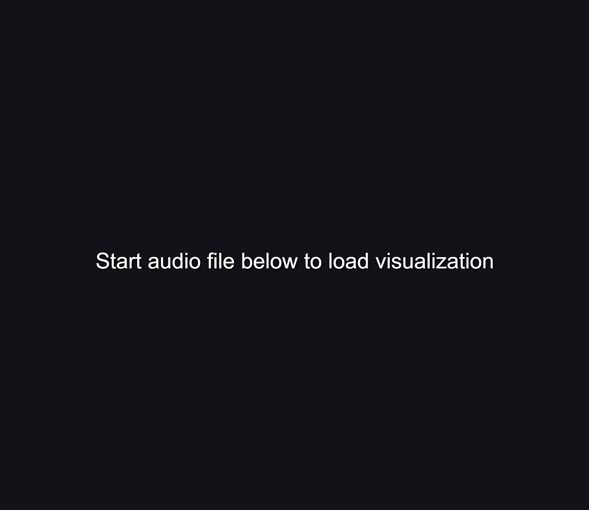

# *Soundcloud Audio Visualizer*
*Soundcloud Audio Visualizer*



# Audio Waveform Visualizer - v2

A Pen created on CodePen.io. Original URL: [https://codepen.io/jhnsnc/pen/jOwjjGJ](https://codepen.io/jhnsnc/pen/jOwjjGJ).

I made a few improvements over my previous attempt here, making it more efficient and animating it. Even still, most of the cost here is the time needed to load the file data--not the computation. We can't use the data from the audio element for this b/c it can only give us data about realtime playback (via the [Analyser Node](https://developer.mozilla.org/en-US/docs/Web/API/AnalyserNode)) and here we're wanting to display the waveform for the entire song.

This time I was going for the same look that Soundcloud has. I opted for drawing the gradients directly via canvas, which works out fairly well if you take advantage of masking. I pre-calculate the gradients, but I should probably also pre-calculate the paths/masks to bring the per-frame drawing time even lower.

Another improvement I could make would be to recalculate the shapes on window resize rather than resizing the canvas based on a predefined number of bars to display. I think Soundcloud does this on resize too (though they probably don't calculate the waveform samples in the browser like I'm doing here).

For my next iteration I think I'll try to make my own style of visualization that incorporates both the whole-song waveform and the realtime frequency visualizer in the same UI.


### *Technologies* :
- [*SCSS*](https://sass-lang.com/)

### *Installation process* :
- clone repo
- navigate to project root folder
- install all dependencies with yarn or npm i
- run with yarn start or npm

```bash
$ git clone https://github.com/RandolphG/Twitter-Heart
$ cd project folder
$ yarn or npm i
$ yarn start or npm start
```

## *Application Sections*

Application is split mainly in one part.
- Visualizer Component
